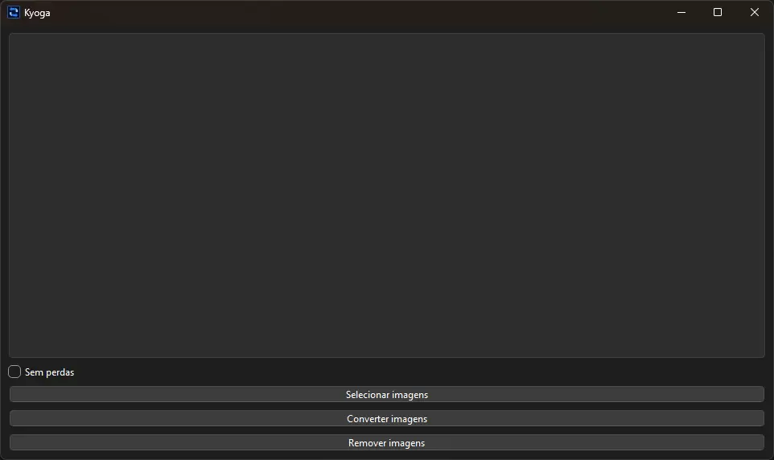
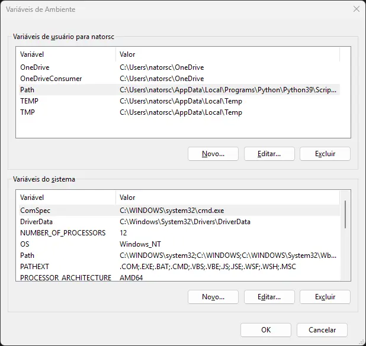

<br>

[](./README.md)
[](README.pt-br.md)

<br>

[](https://github.com/natorsc/kyoga "Go to the repository.")
&emsp;
[](https://github.com/natorsc/kyoga)
&emsp;
[](https://github.com/natorsc/kyoga)

[](./LICENSE)

[](https://pdm-project.org)

# Kyoga

Image converter to the [webp](https://developers.google.com/speed/webp) format.

---

## Dependencies

To use this software, the `libwebp` library must be installed on your operating system.

### Linux

#### Alpine

```bash
apk add \
libwebp
```

#### Arch Linux

```bash
sudo pacman -S \
libwebp
```

#### CentOS

```bash
sudo yum install \
libwebp-tools
```

#### Fedora

```bash
sudo dnf install \
libwebp-tools
```

#### Ubuntu

```bash
sudo apt install \
libwebp
```

### macOS

#### Homebrew

```bash
brew install \
webp
```

- [https://formulae.brew.sh/formula/webp](https://formulae.brew.sh/formula/webp).

### Microsoft Windows

#### Windows (WSL2)

```bash
sudo apt update && \
sudo apt install webp
```

### Precompiled Utility

Google provides precompiled utilities for the following operating systems:

- Microsoft Windows (x64).
- Linux (aarch64).
- Linux (x86-64).
- macOS (arm64).
- macOS (x86-64).

To download the utility, visit:

- [https://developers.google.com/speed/webp/docs/precompiled](https://developers.google.com/speed/webp/docs/precompiled).

After downloading, extract the file to a directory that **will not be removed**.

Then add the `bin` folder to your operating system's `PATH`.

#### Linux

Edit the `.bashrc` file and add the path to the `bin` folder:

```bash
export PATH="path/to-folder/bin:$PATH"
```

> Some Linux distributions already have `$HOME/.local/bin` and `$HOME/bin` folders mapped in the `PATH` variable.
>
> In this case, copy the binaries to one of these folders.

#### macOS

Add the path to the `bin` folder in the `.bash_profile` file:

```bash
export PATH="$PATH:path/to-folder/bin"
```

Or add a file with the path in the `paths.d` directory:

```bash
sudo -s 'echo "path/to-folder/bin" > /etc/paths.d/libwebp'
```

#### Microsoft Windows

Open the Environment Variables application:



Select the `Path` variable, click the `Edit...` button, and add the path to the `bin` folder.

---

## Flatpak

To add Flathub:

```bash
flatpak remote-add --if-not-exists flathub https://dl.flathub.org/repo/flathub.flatpakrepo
```

### Runtime and SDK

```bash
flatpak install org.kde.Platform/x86_64/6.8 org.kde.Sdk/x86_64/6.8 ```

```bash
flatpak install flathub io.qt.PySide.BaseApp/x86_64/6.8
```

### flatpak-builder

#### Fedora

```bash
sudo dnf install flatpak-builder
```

To create the package:

```bash
flatpak-builder --force-clean flatpak-build-dir com.github.natorsc.Kyoga.json
```

To test:

```bash
flatpak-builder --run flatpak-build-dir com.github.natorsc.Kyoga.json kyoga
```

To distribute:

```bash
flatpak-builder --repo kyoga-master --force-clean --ccache flatpak-build-dir com.github.natorsc.Kyoga.json
```

```bash
flatpak build-bundle kyoga-master kyoga.flatpak com.github.natorsc.Kyoga
```
