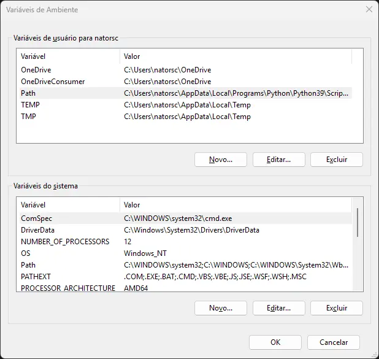

<br>

[](./README.md)
[](README.pt-br.md)

<br>

[](https://github.com/natorsc/kyoga "Ir para o repositório.")
&emsp;
[](https://github.com/natorsc/kyoga)
&emsp;
[](https://github.com/natorsc/kyoga)

[](./LICENSE)

[](https://pdm-project.org)

# Kyoga

Conversor de imagens para o formato [webp](https://developers.google.com/speed/webp).

---

## Dependências

Para a utilização deste software a biblioteca `libwebp` deve estar instalada no sistema operacional.

### Linux

#### Alpine

```bash
apk add \
libwebp
```

#### Arch Linux

```bash
sudo pacman -S \
libwebp
```

#### CentOS

```bash
sudo yum install \
libwebp-tools
```

#### Fedora

```bash
sudo dnf install \
libwebp-tools
```

#### Ubuntu

```bash
sudo apt install \
libwebp
```

### macOS

#### Homebrew

```bash
brew install \
webp
```

- [https://formulae.brew.sh/formula/webp](https://formulae.brew.sh/formula/webp).

### Microsoft Windows

#### Windows (WSL2)

```bash
sudo apt update && \
sudo apt install webp
```

### Utilitário pré-compilado

O Google fornece o utilitários pré-compilados para os seguintes sistemas operacionais:

- Microsoft Windows (x64).
- Linux (aarch64).
- Linux (x86-64).
- macOS (arm64).
- macOS (x86-64).

Para baixar o utilitário acesse:

- [https://developers.google.com/speed/webp/docs/precompiled](https://developers.google.com/speed/webp/docs/precompiled).

Após realizar o download descompacte o arquivo em um diretório onde o mesmo **não será removido**.

Em seguida adicione a pasta `bin` ao `PATH` do sistema operacional.

#### Linux

Edite o arquivo `.bashrc` e adicione o caminho até a basta `bin`:

```bash
export PATH="caminho/nome-da-pasta/bin:$PATH"
```

> Algumas distribuições Linux já possuem as pastas `$HOME/.local/bin` e `$HOME/bin` mapeadas na variável `PATH`.
>
> Neste caso copie os binário para uma dessas pastas.

#### macOS

Adicione o caminho até a pasta `bin` no arquivo `.bash_profile`:

```bash
export PATH="$PATH:caminho/nome-da-pasta/bin"
```

Ou adicione um arquivo com o caminho no diretório `paths.d`:

```bash
sudo -s 'echo "caminho/nome-da-pasta/bin" > /etc/paths.d/libwebp'
```

#### Microsoft Windows

Abra o aplicativo Variáveis de Ambiente:



Selecione a variável `Path`, clique no botão `Editar...` e adicione o caminho até a pasta `bin`.

---

## Flatpak

Para adicionar o Flathub:

```bash
flatpak remote-add \
--if-not-exists flathub https://dl.flathub.org/repo/flathub.flatpakrepo
```

### Runtime e SDK

```bash
flatpak install \
org.kde.Platform/x86_64/6.8 \
org.kde.Sdk/x86_64/6.8 \
```

```bash
flatpak install \
flathub \
io.qt.PySide.BaseApp/x86_64/6.8
```

### flatpak-builder

#### Fedora

```bash
sudo dnf install \
flatpak-builder
```

Para criar o pacote:

```bash
flatpak-builder \
--force-clean \
flatpak-build-dir \
com.github.natorsc.Kyoga.json
```

Para testar:

```bash
flatpak-builder \
--run \
flatpak-build-dir \
com.github.natorsc.Kyoga.json \
kyoga
```

Para distribuir:

```bash
flatpak-builder \
--repo kyoga-master \
--force-clean \
--ccache \
flatpak-build-dir \
com.github.natorsc.Kyoga.json
```

```bash
flatpak \
build-bundle \
kyoga-master \
kyoga.flatpak \
com.github.natorsc.Kyoga
```
